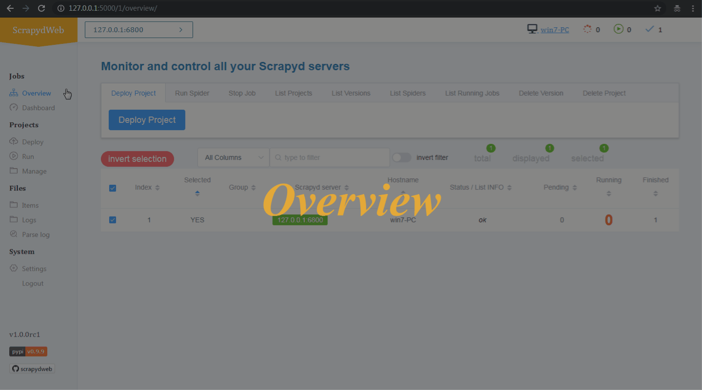
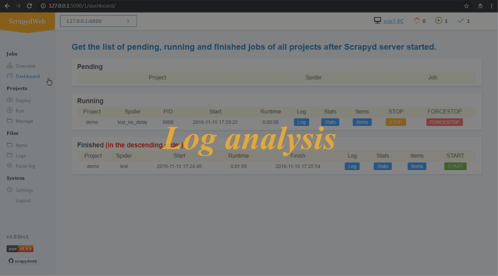
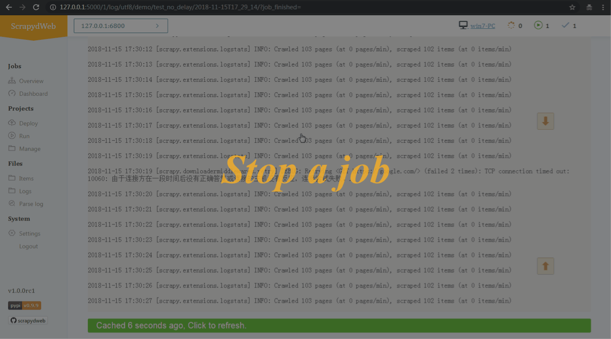
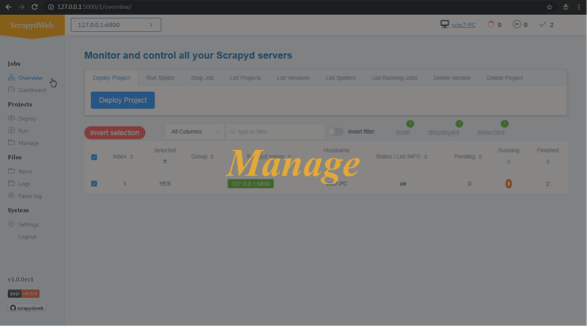
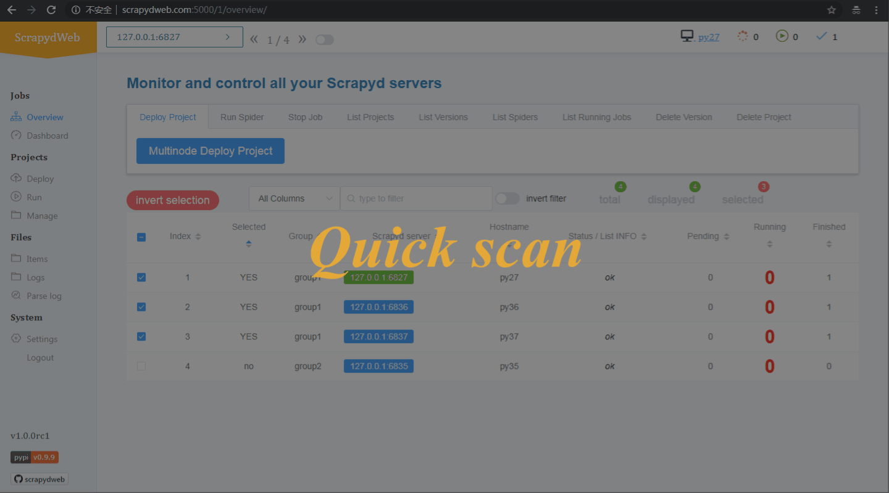

[:framed_picture: Screenshots](./README.md) | :film_strip: Gif Demo | [:back: ScrapydWeb](https://github.com/my8100/scrapydweb)

# GIF DEMO

- [single_scrapyd_deploy_run](#single_scrapyd_deploy_run-)
- [single_scrapyd_log_analysis](#single_scrapyd_log_analysis-)
- [single_scrapyd_stop](#single_scrapyd_stop-)
- [single_scrapyd_manage](#single_scrapyd_manage-)
- [scrapyd_cluster_select_deploy_run](#scrapyd_cluster_select_deploy_run-)
- [scrapyd_cluster_quick_scan_skip](#scrapyd_cluster_quick_scan_skip-)

## single_scrapyd_deploy_run

## single_scrapyd_log_analysis

## single_scrapyd_stop

## single_scrapyd_manage

## scrapyd_cluster_select_deploy_run

## scrapyd_cluster_quick_scan_skip

[⬆ Jump to top](#gif-demo)

[:framed_picture: Screenshots](./README.md) | :film_strip: Gif Demo | [:back: ScrapydWeb](https://github.com/my8100/scrapydweb)
